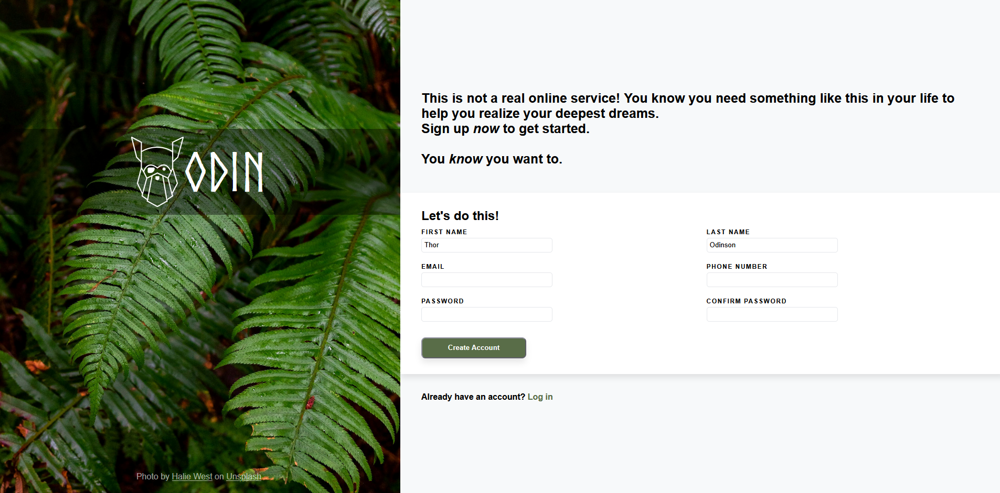

This is my version on the form challenge from the Odin Project.

This is the reference picture:

And this is what I did:

The main thing that I did differently, is the "Create Account" button.
For me, it is more locial to include the submit-button in the same area with the form.
